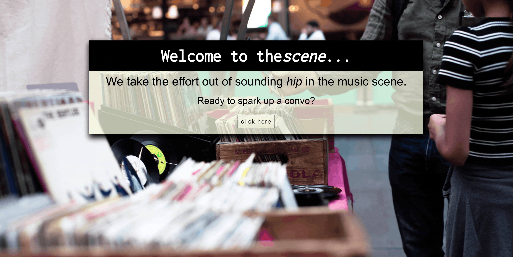

# 
the<i>scene</i>

### Table of Contents
- [Overview](#overview)
- [Learning Goals](#learning-goals)
- [Installation & Viewing](#installation-and-viewing)
- [Functionality](#functionality)
- [Future Additions](#future-additions)
- [Tech Stack](#tech-stack)
- [Contributors](#contributors)

## Overview

Perhaps you've been invited on a date with a musician, or you've found yourself at a party of hipsters who love to chat music, or maybe you just want to find a new genre or two. Well, friend, you're in luck... the<i>scene</i> takes the effort out of sounding *hip* in the music scene and kicks off the conversation for you.  

the<i>scene</i> was built with React, using the [The Genrenator API](https://binaryjazz.us/wp-json/genrenator/v1/story/) to display a random genre and story to shuffle through and save to favorites. This application was built as the final solo project of Mod3 at [Turing](turing.edu).  The goal was to build an application for a niche audience using React, React Router, a third party API, and Cypress.

View original project spec [here.](https://frontend.turing.edu/projects/module-3/niche-audience.html)

### Learning Goals

To solidify and demonstrate the understanding of:

- React fundementals and modular code architecture
- Router to create a multi-page and sophisticated UX
- Cypress testing to test the application end-to-end

## Installation and Viewing 

This application is deployed to Vercel. You may view the live application [here](https://the-scene.vercel.app/).

To view this application on your local machine:

- Clone down this repository
- Run `npm i` in your terminal
- Run `npm start` in your terminal
- To view Cypress tests, open a separate tab in your terminal and run `npm run cypress`

## Functionality 

#### Welcome  
 

#### Shufflin' & Favoriting
- User may shuffle until they find a convo starter that speaks to them, and favorite it! 

#### View Favorites
- User may view all favorites and remove ones that they no longer want.  

 

#### Mobile View/Responsive
- Site is responsive and will change layouts across desktop, tablet, and phone screens 

## Future Additions

- *Link to learn more*: Link to Google to learn more about a genre. 
- *Music*: Using the Spotify API to bring in background music to add a little pizazz! 
- *Local Storage*: Adding local storage functionality to save and view favorites at any time on a device.

## Tech Stack

  

 
 

 

 

## Contributors
### Author
<table>
     <tr>
        <td> Rachael Carroll <a href="https://github.com/rachaelcarroll">GitHub</td>
      </tr>
      </tr>
<td></td>
    </tr>
</table>

### Project Managers
- [Kayla Gordon](https://github.com/kaylaewood)
- [Scott Ertmer](https://github.com/sertmer)

**************************************************************************

**[Back to top](#table-of-contents)**

